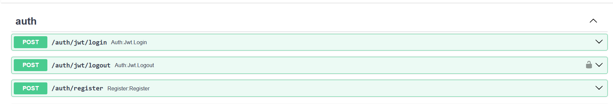
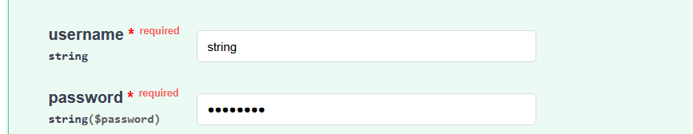
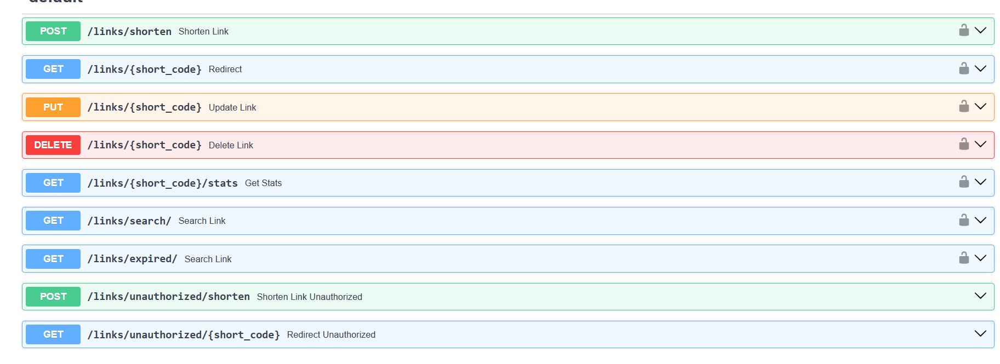
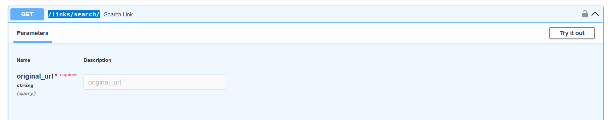

# Сервис для сокращения ссылок на FastAPI

Веб‑приложение на FastAPI для сокращения ссылок

## API

* OpenApi документация доступна на http://127.0.0.1:8000/docs после старта приложения

* **Авторизация** 

* /auth/jwt/login - залогиниться, нужен имя пользователя и пароль

* /auth/jwt/logout - разлогиниться

* /auth/register - зарегистрироваться, пример запроса:

{
  "email": "user@example.com",
  "password": "string",
  "is_active": true,
  "is_superuser": false,
  "is_verified": false
}

* **Работа с ссылками**

* /links/shorten - создание короткой ссылки

{
  "original_url": "string",
  "custom_alias": "string",
  "expires_at": "2026-03-15T19:39:46.432Z"
}

* /links/{short_code} - Получение оригинальной ссылки (Что-то не получилось разобраться именно с редиректом, поэтому сделал просто возврашение оригинальной ссылки)
* /links/{short_code} - Обновление ссылки (время действия или/и оригинального URL). Сделал в одном ендпоинте

{
  "original_url": "string",
  "expires_at": "2026-03-15T19:42:21.161Z"
}

* /links/{short_code} - удаление ссылки, можно удалять только свои ссылки
* /links/search/ - поиск по оригинальному URL (параметр original_url) (среди всех ссылок залогинненого пользователя)

* /links/expired/ - получение всех истёкших ссылок для залогиненого пользователя
* /links/unauthorized/shorten - получение короткой ссылки без авторизации. В таком случае ссылка живёт только 10 минут в хэше

{
  "original_url": "string"
}

* /links/unauthorized/{short_code} - получение оригинальной ссылки для незарегистрированного пользователя
 
  

## Запуск приложения
* Все необходимые файлы/настройки сделаны в docker-compose.yaml, поэтому достаточно просто запустить его. Для БД и Redis используются стандартные порты (5432 и 6379)

